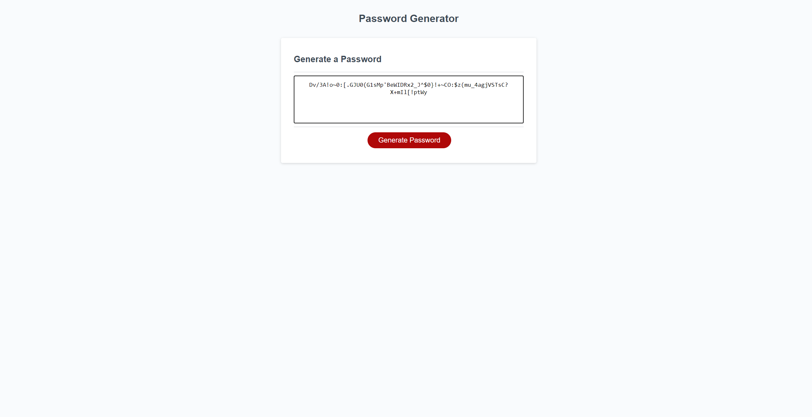

# Password-generator
[github](https://github.com/Nparson88/Password-generator)
# random password generator assignment

[website](https://nparson88.github.io/Password-generator/)
# made with HTML,CSS, and Javascript
# password generator allows you to create randomized passwords using parameters set by the user. parameters can be special, numeric, uppercase, and lowercase characters.
# Github is linked above 